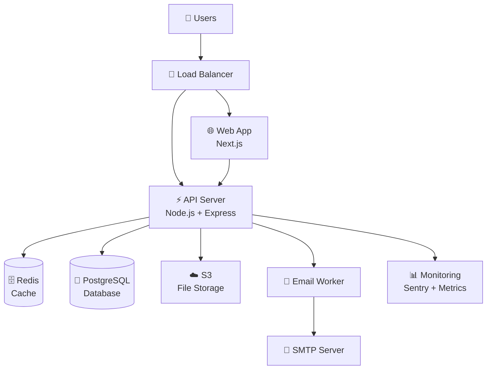
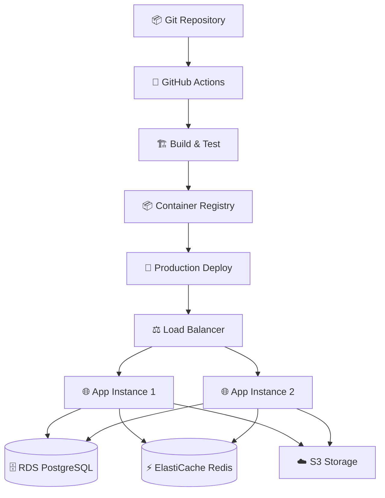

# 🏗️ NOURX - Architecture Détaillée

## 📋 Vue d'Ensemble

NOURX est une application web moderne construite selon une architecture **multi-tier** avec séparation claire des responsabilités et approche **API-first**.

## 🎯 Principes Architecturaux

### 1. **Separation of Concerns**
- **Frontend** : Interface utilisateur et logique de présentation
- **Backend API** : Logique métier et accès aux données
- **Database** : Persistance des données avec cache

### 2. **API-First Design**
- Contrats d'API définis en premier
- Validation stricte avec Zod
- Documentation automatique

### 3. **Multi-Tenant Architecture**
- Isolation des données par `organization_id`
- Sécurité au niveau des requêtes
- Portails séparés par type d'utilisateur

### 4. **Scalability & Performance**
- Cache Redis pour les données fréquentes
- Stockage cloud S3 pour les fichiers
- Workers background pour les tâches lourdes

## 🏛️ Architecture Globale



## 🎨 Frontend Architecture

### Structure Next.js 14

```
frontend/src/
├── app/                          # App Router (Next.js 14)
│   ├── (admin-portal)/          # Admin routes group
│   │   └── admin/               # /admin/* routes
│   ├── (client-portal)/         # Client routes group
│   │   └── client/              # /client/* routes
│   ├── auth/                    # Authentication pages
│   ├── layout.tsx               # Root layout
│   └── page.tsx                 # Landing page
├── components/                   # Reusable components
│   ├── ui/                      # Base UI components (shadcn/ui)
│   ├── forms/                   # Form components
│   ├── layout/                  # Layout components
│   └── features/                # Feature-specific components
├── lib/                         # Utilities and configurations
│   ├── api.ts                   # API client
│   ├── auth.ts                  # Auth configuration
│   └── utils.ts                 # Utility functions
└── middleware.ts                # Route middleware
```

### Design Patterns

#### 1. **Route Groups**
```typescript
// Separate portals with different layouts
(admin-portal)/     // Admin-specific layout
(client-portal)/    // Client-specific layout
auth/              // Authentication layout
```

#### 2. **Server Components par Défaut**
```typescript
// Composants server par défaut pour SEO et performance
export default async function ProjectsPage({ params }: Props) {
  const projects = await getProjects(params.orgId);
  return <ProjectsList projects={projects} />;
}
```

#### 3. **Client Components pour Interactivité**
```typescript
'use client';  // Marquage explicite pour composants interactifs

export function TicketForm() {
  const [isSubmitting, setIsSubmitting] = useState(false);
  // ... logique interactive
}
```

## ⚙️ Backend Architecture

### Structure Express + TypeScript

```
backend/src/
├── app.ts                       # Configuration Express
├── server.ts                    # Point d'entrée serveur
├── config/                      # Configurations
│   ├── index.ts                 # Configuration centralisée
│   ├── database.ts              # Config base de données
│   └── auth.ts                  # Config authentication
├── routes/                      # Définition des routes
│   ├── api.ts                   # Router principal
│   ├── organizations.ts         # Routes organisations
│   ├── tickets.ts               # Routes tickets
│   └── ...                      # Autres routes métier
├── services/                    # Logique métier
│   ├── userClient.service.ts    # Service utilisateurs clients
│   ├── ticket.service.ts        # Service tickets
│   ├── email.service.ts         # Service emails
│   └── ...                      # Autres services
├── middleware/                  # Middlewares Express
│   ├── auth.ts                  # Middleware authentification
│   ├── roles.ts                 # Middleware autorisations
│   ├── rateLimiting.ts         # Rate limiting
│   └── ...                      # Autres middlewares
├── lib/                         # Bibliothèques utilitaires
│   ├── db.ts                    # Instance base de données
│   ├── errors.ts                # Gestion d'erreurs
│   ├── logger.ts                # Configuration logs
│   └── ...                      # Utilitaires
├── types/                       # Définitions TypeScript
│   ├── auth.ts                  # Types authentification
│   ├── database.ts              # Types base de données
│   └── ...                      # Autres types
└── workers/                     # Workers background
    ├── email-worker.ts          # Worker emails
    └── ...                      # Autres workers
```

### Patterns Backend

#### 1. **Service Layer Pattern**
```typescript
// Couche service pour la logique métier
export class TicketService {
  async createTicket(input: CreateTicketInput, context: RequestContext) {
    // 1. Validation avec Zod
    const validated = await CreateTicketInput.parseAsync(input);
    
    // 2. Logique métier dans une transaction
    return await withTransaction(async (trx) => {
      const ticket = await this.insertTicket(validated, trx);
      await this.sendNotification(ticket, trx);
      await this.auditLog(ticket, context, trx);
      return ticket;
    });
  }
}
```

#### 2. **Repository Pattern avec Kysely**
```typescript
// Accès données avec Kysely query builder
export class TicketRepository {
  async findByOrganization(orgId: string, filters: TicketFilters) {
    let query = db
      .selectFrom('ticket')
      .selectAll()
      .where('organization_id', '=', orgId)
      .where('deleted_at', 'is', null);

    if (filters.status) {
      query = query.where('status', '=', filters.status);
    }

    return await query.execute();
  }
}
```

#### 3. **Middleware Chain**
```typescript
// Chaînage des middlewares pour sécurité
router.patch(
  '/tickets/:id',
  isAuthenticated,           // Vérification auth
  requireRoles(['admin', 'agent']),  // Vérification rôles
  requireOrgAccess(),        // Vérification organisation
  validateBody(UpdateTicketSchema),  // Validation input
  ticketController.updateTicket      // Contrôleur
);
```

## 💾 Data Architecture

### Base de Données PostgreSQL

#### Schema Principal

```sql
-- Multi-tenancy avec organisations
CREATE TABLE organization (
    id UUID PRIMARY KEY,
    name VARCHAR(255) NOT NULL,
    is_active BOOLEAN DEFAULT true,
    created_at TIMESTAMPTZ DEFAULT now()
);

-- Utilisateurs administrateurs
CREATE TABLE user_admin (
    id UUID PRIMARY KEY,
    organization_id UUID REFERENCES organization(id),
    email CITEXT UNIQUE NOT NULL,
    role user_role NOT NULL,
    is_active BOOLEAN DEFAULT true
);

-- Utilisateurs clients (multi-tenant)
CREATE TABLE user_client (
    id UUID PRIMARY KEY,
    organization_id UUID NOT NULL REFERENCES organization(id),
    email CITEXT NOT NULL,
    role client_role DEFAULT 'reader',
    UNIQUE(organization_id, email)
);

-- Tickets avec SLA automatique
CREATE TABLE ticket (
    id UUID PRIMARY KEY,
    organization_id UUID NOT NULL REFERENCES organization(id),
    ticket_number VARCHAR(20) UNIQUE NOT NULL,
    priority ticket_priority NOT NULL,
    status ticket_status DEFAULT 'new',
    sla_deadline TIMESTAMPTZ NOT NULL,
    created_at TIMESTAMPTZ DEFAULT now()
);
```

#### Patterns de Données

##### 1. **Multi-Tenancy**
```sql
-- Isolation par organization_id dans toutes les tables
SELECT * FROM ticket 
WHERE organization_id = $1  -- Toujours filtrer par org
  AND deleted_at IS NULL;   -- Soft delete
```

##### 2. **Soft Delete**
```sql
-- Marquage de suppression au lieu de DELETE
UPDATE ticket 
SET deleted_at = now(), 
    updated_by = $1 
WHERE id = $2;
```

##### 3. **Audit Trail**
```sql
-- Log toutes les actions critiques
INSERT INTO audit_log (
    actor_id, action, resource_type, resource_id,
    details_json, organization_id
) VALUES ($1, 'ticket.create', 'ticket', $2, $3, $4);
```

##### 4. **Versioning**
```sql
-- Versioning pour documents/livrables
CREATE TABLE deliverable (
    id UUID PRIMARY KEY,
    version INTEGER NOT NULL DEFAULT 1,
    parent_id UUID REFERENCES deliverable(id),  -- Version précédente
    file_path VARCHAR(512) NOT NULL,
    is_current BOOLEAN DEFAULT true
);
```

### Cache Redis

#### Structure du Cache

```typescript
// Patterns de clés Redis
const CACHE_KEYS = {
  user: (id: string) => `user:${id}`,
  session: (id: string) => `session:${id}`,
  org_stats: (orgId: string) => `org:${orgId}:stats`,
  rate_limit: (ip: string, endpoint: string) => `rl:${ip}:${endpoint}`,
} as const;

// Service cache générique
export class CacheService {
  async get<T>(key: string): Promise<T | null> {
    const cached = await redis.get(key);
    return cached ? JSON.parse(cached) : null;
  }

  async set(key: string, value: any, ttl = 3600) {
    await redis.setex(key, ttl, JSON.stringify(value));
  }

  async invalidatePattern(pattern: string) {
    const keys = await redis.keys(pattern);
    if (keys.length > 0) await redis.del(...keys);
  }
}
```

## 🔐 Authentication & Authorization

### Better Auth Integration

#### Configuration
```typescript
export const auth = betterAuth({
  database: db,  // Kysely instance
  
  emailAndPassword: {
    enabled: true,
    requireEmailVerification: true,
  },
  
  user: {
    additionalFields: {
      role: { type: 'string', required: true },
      organizationId: { type: 'string', required: false },
    },
  },
  
  session: {
    expiresIn: 60 * 60 * 24 * 7,  // 7 jours
    updateAge: 60 * 60 * 24,      // Mise à jour quotidienne
  },
});
```

#### Middleware d'Authorization

```typescript
// Middleware rôles hiérarchiques
export function requireRoles(allowedRoles: UserRole[]) {
  return (req: AuthRequest, res: Response, next: NextFunction) => {
    const userRoles = req.auth.roles || [];
    const hasRequiredRole = allowedRoles.some(role => 
      userRoles.includes(role)
    );
    
    if (!hasRequiredRole) {
      throw new AppError('Insufficient permissions', 403);
    }
    
    next();
  };
}

// Middleware organisation
export function requireOrgAccess() {
  return (req: AuthRequest, res: Response, next: NextFunction) => {
    const requestedOrgId = req.params.orgId;
    const userOrgId = req.auth.organizationId;
    
    if (requestedOrgId !== userOrgId && !isSystemAdmin(req.auth)) {
      throw new AppError('Organization access denied', 403);
    }
    
    next();
  };
}
```

## 📨 Email System Architecture

### Email Worker Pattern

```typescript
// Worker background pour emails
export class EmailWorker {
  private intervalId?: NodeJS.Timeout;
  
  async start() {
    this.intervalId = setInterval(
      () => this.processEmails(),
      this.processInterval
    );
  }
  
  private async processEmails() {
    // 1. Récupérer emails en attente
    const pendingEmails = await emailService.getPendingEmails();
    
    // 2. Traiter par batch
    for (const email of pendingEmails) {
      try {
        await emailService.processQueuedEmail(email.id);
        await this.markAsProcessed(email.id);
      } catch (error) {
        await this.handleEmailError(email.id, error);
      }
    }
  }
}
```

### Email Templates

```typescript
// Système de templates avec variables
interface EmailTemplate {
  name: string;
  subject: string;  // "Ticket #{{ticket_number}} - {{status}}"
  htmlContent: string;  // HTML avec {{variables}}
  textContent?: string;
  variables: string[];  // ['ticket_number', 'status', 'user_name']
}

// Service de rendu
export class EmailTemplateService {
  renderTemplate(template: EmailTemplate, variables: Record<string, any>) {
    let html = template.htmlContent;
    let subject = template.subject;
    
    // Remplacement des variables {{variable}}
    Object.entries(variables).forEach(([key, value]) => {
      const regex = new RegExp(`{{\\s*${key}\\s*}}`, 'g');
      html = html.replace(regex, String(value));
      subject = subject.replace(regex, String(value));
    });
    
    return { subject, html };
  }
}
```

## 📁 File Storage Architecture

### Multi-Provider Storage

```typescript
// Interface commune pour stockage
interface FileStorageProvider {
  upload(buffer: Buffer, key: string, metadata: FileMetadata): Promise<string>;
  download(key: string): Promise<Buffer>;
  delete(key: string): Promise<void>;
  getPresignedUrl(key: string, expiresIn: number): Promise<string>;
}

// Implémentation S3
export class S3StorageProvider implements FileStorageProvider {
  async upload(buffer: Buffer, key: string, metadata: FileMetadata) {
    const command = new PutObjectCommand({
      Bucket: this.bucketName,
      Key: key,
      Body: buffer,
      ContentType: metadata.mimeType,
      Metadata: {
        originalName: metadata.fileName,
        uploadedBy: metadata.uploadedBy,
      },
    });
    
    await this.s3Client.send(command);
    return key;
  }
}

// Service de stockage avec fallback
export class FileStorageService {
  constructor(
    private primaryProvider: FileStorageProvider,
    private fallbackProvider?: FileStorageProvider
  ) {}
  
  async upload(buffer: Buffer, key: string, metadata: FileMetadata) {
    try {
      return await this.primaryProvider.upload(buffer, key, metadata);
    } catch (error) {
      if (this.fallbackProvider) {
        logger.warn('Primary storage failed, using fallback', { error });
        return await this.fallbackProvider.upload(buffer, key, metadata);
      }
      throw error;
    }
  }
}
```

## 📊 Monitoring & Observability

### Structured Logging

```typescript
// Configuration Pino pour logs structurés
export const logger = pino({
  level: config.log.level,
  formatters: {
    level: (label) => ({ level: label }),
    log: (object) => ({
      ...object,
      environment: config.NODE_ENV,
      service: 'nourx-api',
    }),
  },
  serializers: {
    req: pino.stdSerializers.req,
    res: pino.stdSerializers.res,
    err: pino.stdSerializers.err,
  },
});

// Middleware de logging des requêtes
app.use(pinoHttp({
  logger,
  customLogLevel: (req, res, err) => {
    if (res.statusCode >= 400 && res.statusCode < 500) return 'warn';
    if (res.statusCode >= 500 || err) return 'error';
    return 'info';
  },
  customSuccessMessage: (req, res) => {
    return `${req.method} ${req.url} - ${res.statusCode}`;
  },
}));
```

### Metrics Collection

```typescript
// Service de métriques custom
export class MetricsService {
  async getSystemMetrics(): Promise<SystemMetrics> {
    const [emailMetrics, ticketMetrics, userMetrics] = await Promise.all([
      this.getEmailMetrics(),
      this.getTicketMetrics(), 
      this.getUserMetrics(),
    ]);
    
    return {
      emails: emailMetrics,
      tickets: ticketMetrics,
      users: userMetrics,
      uptime: process.uptime(),
      memory: process.memoryUsage(),
      timestamp: new Date(),
    };
  }
  
  async getEmailMetrics() {
    return await db
      .selectFrom('email_outbox')
      .select([
        (eb) => eb.fn.count('id').as('total'),
        (eb) => eb.fn.count('id').filterWhere('status', '=', 'sent').as('sent'),
        (eb) => eb.fn.count('id').filterWhere('status', '=', 'failed').as('failed'),
        (eb) => eb.fn.count('id').filterWhere('status', '=', 'pending').as('pending'),
      ])
      .executeTakeFirst();
  }
}
```

## 🔄 CI/CD & Deployment

### Production Architecture



### Docker Configuration

```dockerfile
# Production Dockerfile
FROM node:18-alpine AS builder
WORKDIR /app
COPY package*.json ./
RUN npm ci --only=production && npm cache clean --force

FROM node:18-alpine AS runtime
WORKDIR /app
COPY --from=builder /app/node_modules ./node_modules
COPY . .
RUN npm run build

EXPOSE 3001
CMD ["npm", "start"]
```

## 🔒 Security Architecture

### Defense in Depth

1. **Network Level**
   - WAF (Web Application Firewall)
   - DDoS protection
   - SSL/TLS encryption

2. **Application Level**
   - Rate limiting avec Redis
   - Input validation avec Zod
   - Output sanitization
   - CORS configuration stricte

3. **Authentication Level**
   - JWT tokens avec expiration courte
   - Session management sécurisé
   - Account lockout après tentatives échouées

4. **Authorization Level**
   - Role-based access control (RBAC)
   - Organization-level isolation
   - API endpoint protection

5. **Data Level**
   - Database input validation
   - SQL injection prevention
   - Encryption at rest (planned)
   - Backup encryption

### Security Headers

```typescript
// Configuration Helmet pour sécurité
app.use(helmet({
  contentSecurityPolicy: {
    directives: {
      defaultSrc: ["'self'"],
      styleSrc: ["'self'", "'unsafe-inline'"],
      scriptSrc: ["'self'"],
      imgSrc: ["'self'", "data:", "https:"],
    },
  },
  hsts: {
    maxAge: 31536000,
    includeSubDomains: true,
    preload: true,
  },
}));
```

## 🚀 Performance Optimization

### Backend Performance

1. **Database Optimization**
   - Index sur colonnes fréquemment utilisées
   - Query optimization avec EXPLAIN
   - Connection pooling

2. **Cache Strategy**
   - Redis pour sessions et données fréquentes
   - Cache invalidation intelligent
   - Cache warming pour données critiques

3. **API Performance**
   - Pagination pour listes longues
   - Compression gzip
   - Response caching headers

### Frontend Performance

1. **Bundle Optimization**
   - Code splitting par route
   - Tree shaking automatique
   - Lazy loading des composants

2. **Image Optimization**
   - Next.js Image component
   - WebP format avec fallback
   - Responsive images

3. **Caching Strategy**
   - Static file caching
   - API response caching
   - Service worker (planned)

---

Cette architecture est conçue pour être **scalable**, **maintenable** et **sécurisée**, tout en offrant une **excellente expérience développeur** et une **performance optimale** en production.